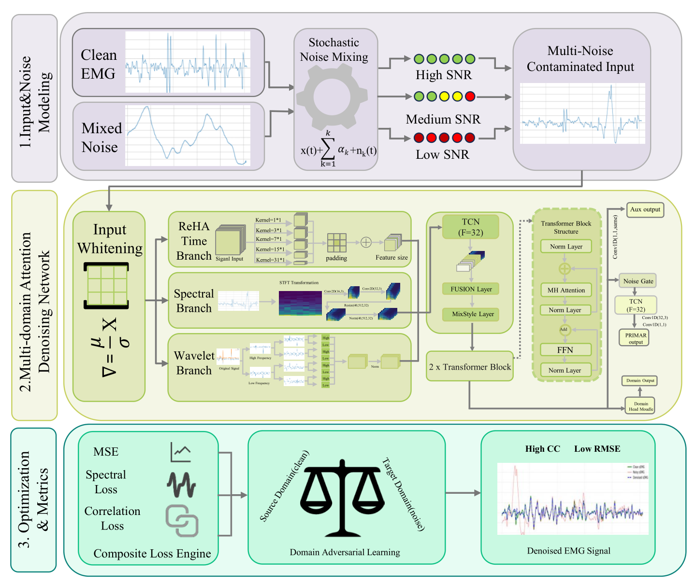
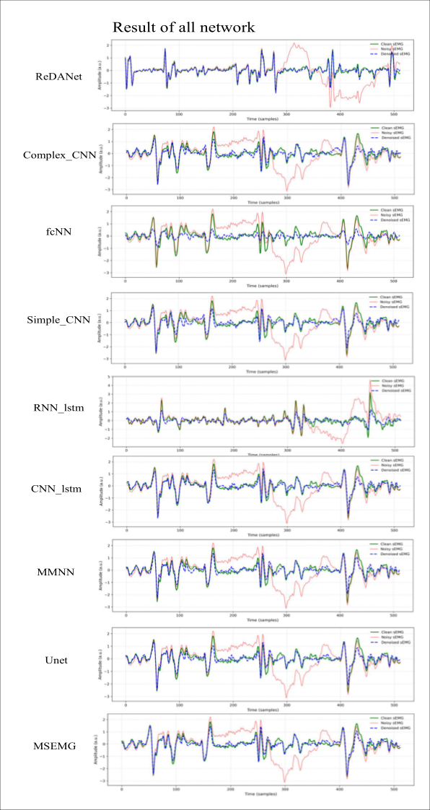
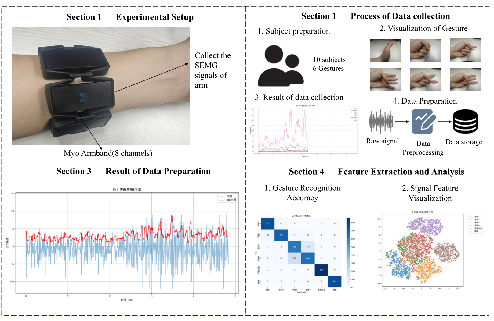

# ReDANet: Adaptive Multi-Scale Representation Learning for Robust EMG Signal Denoising

<div align="center">

[](#) 
[](#) 
[](#)

</div>

Official implementation of the paper: **"ReDANet: Deep Learning Framework for Robust Physiological Signal Denoising"**.

---

## 🔬 Abstract
Surface Electromyography (sEMG) signals are inherently susceptible to heterogeneous noise sources, which severely limits their utility in clinical and rehabilitative applications. We propose **ReDANet**, a novel deep learning architecture that leverages **multi-scale representation learning** and **adaptive cross-domain fusion** to isolate clean physiological components from complex, non-stationary interference. 

### System Architecture
<p align="center">
  
  <br>
  <strong>Figure 1.</strong> The end-to-end architecture of ReDANet, featuring hierarchical feature extraction and adaptive fusion layers.
</p>


---

## 📊 Experimental Results

### 1. Benchmark Comparison (Quantitative)
ReDANet achieves state-of-the-art (SOTA) performance across all primary metrics. In severe noise conditions (SNR ≈ -5.06 dB), our model maintains superior fidelity.

<p align="center">
  
  <br>
  <strong>Figure 3.</strong> Comparative analysis of Signal-to-Noise Ratio (SNR) across 10 different architectures.
</p>

<p align="center">
   
  <br>
  <strong>Figure 4.</strong> Root Mean Square Error (RMSE) and Correlation Coefficient (CC) benchmarks.
</p>

### 2. Ablation Study
The performance gain is significantly attributed to our **Frequency-Wavelet (F+W)** module and **Cross-Subject Transfer** strategy.

<p align="center">
  
  <br>
  <strong>Figure 5.</strong> Impact of individual components on denoising performance.
</p>

### 3. Qualitative Visual Analysis
ReDANet preserves the "burst" characteristics of EMG signals while effectively suppressing baseline wander and motion artifacts.

<p align="center">
  
  <br>
  <strong>Figure 6.</strong> Visualization of reconstructed signals under complex interference.
</p>

---

## 📂 Dataset & Generalization
To evaluate the **cross-domain generalization**, we validated the model using a multi-device setup. The results confirm that the learned representations are invariant to sensor-specific hardware characteristics.

<p align="center">
  
  <br>
  <strong>Figure 7.</strong> Overview of the cross-device and cross-subject validation protocol.
</p>

---

## 🎓 Citation
If you find this work useful for your research, please cite:
```bibtex
@article{ReDANet2026,
  title={Adaptive Multi-Scale Representation Learning for Robust Physiological Signal Denoising},
  author={Anonymous Authors},
  journal={IEEE Transactions on Biomedical Engineering (Under Review)},
  year={2026},
  doi={10.XXXX/XXXX.2026.XXXXXXX}
}